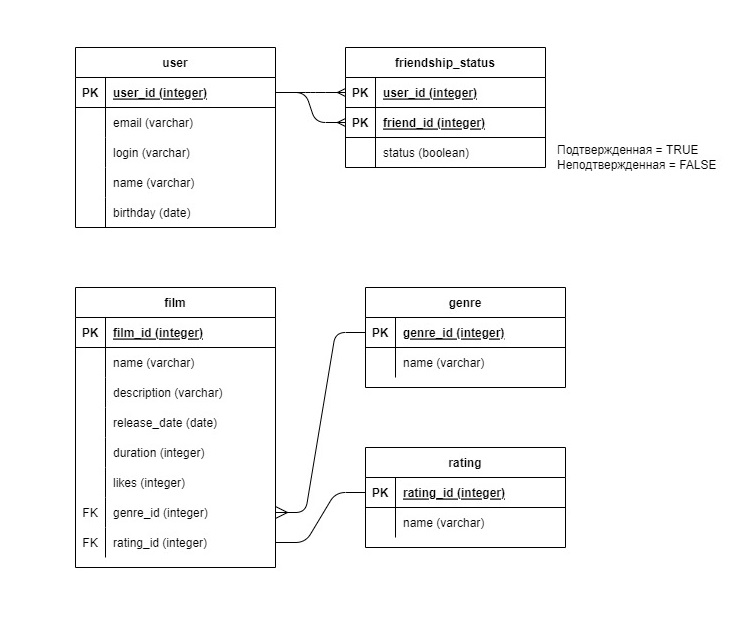

# java-filmorate

Примеры запросов

Получение всех фильмов:

SELECT name

FROM film;

Получение топ-N популярных фильмов:

SELECT name,
       likes
       
FROM film

ORDER BY likes DESC

LIMIT N;

Получение списка друзей у пользователя N:

SELECT u.login

FROM user AS u

INNER JOIN friendship_status AS f ON f.friend_id = u.user_id

WHERE f.user_id = 'N';
